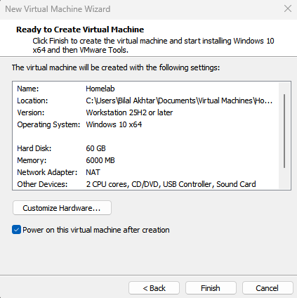
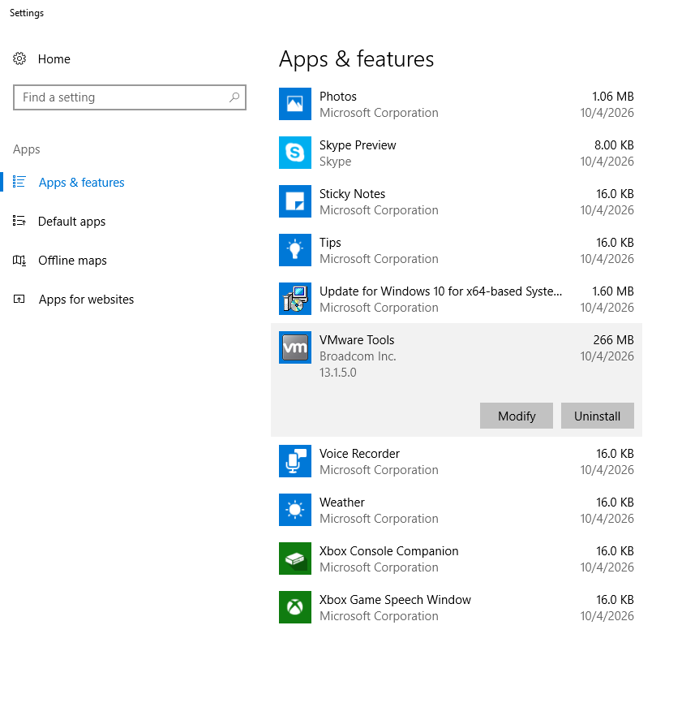
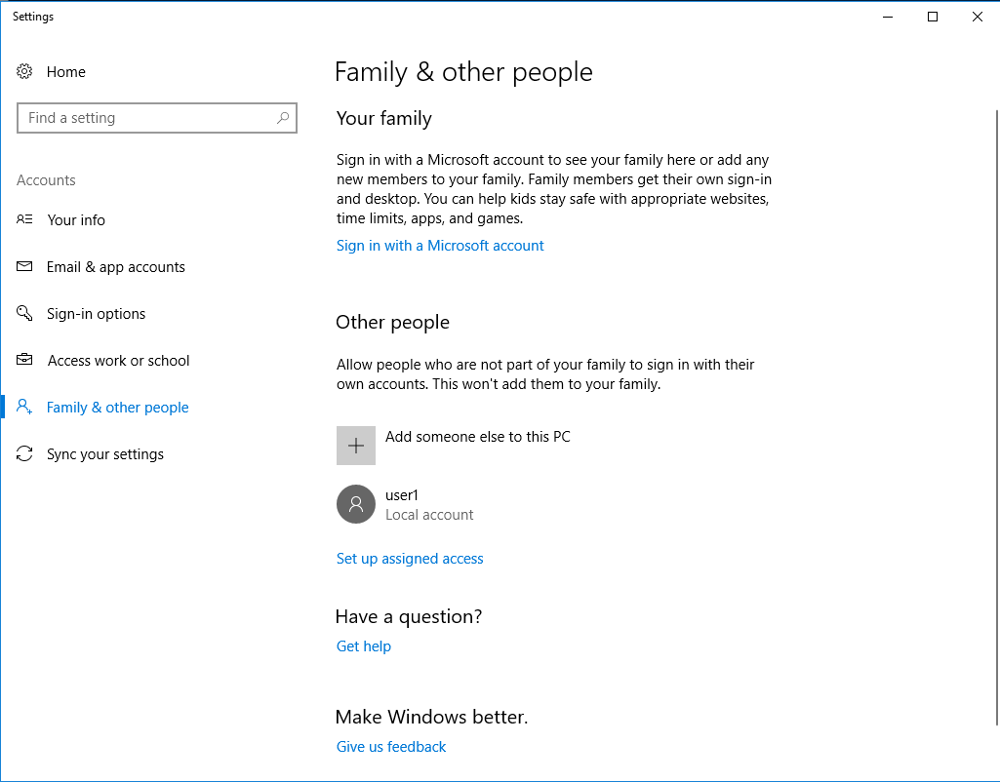
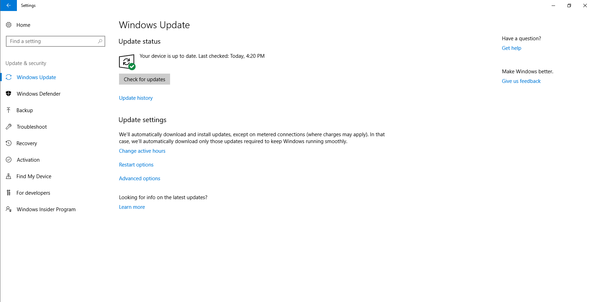

# Phase 1: Build

## What I Built

A Windows 10 virtual machine named Homelab, built in VMware Workstation using a school-provided Windows 10 Enterprise ISO. This is the foundation for the next two phases of this lab, Configure and Secure, then Manage and Troubleshoot.

## Configuration Decisions

I used the Custom setup option instead of Typical so I could see and choose every setting myself, instead of letting VMware decide for me. Here is what I chose and why.

| Setting  | Choice                | Why                                                                                                                                                                                                    |
| -------- | --------------------- | ------------------------------------------------------------------------------------------------------------------------------------------------------------------------------------------------------ |
| Firmware | UEFI with Secure Boot | Modern computers use UEFI, and Secure Boot blocks unsigned software from loading at startup                                                                                                            |
| CPU      | 2 cores               | My host machine has 6 cores. Giving the VM 2 leaves 4 for the host so neither slows down                                                                                                               |
| Memory   | 6 GB                  | My host has 16 GB. Windows 10 runs comfortably on 4 GB, so 6 GB gives some extra room and leaves 10 GB for the host                                                                                    |
| Disk     | 60 GB, single file    | I first thought 20 GB would work, but Windows alone needs about 20 to 32 GB. 60 GB leaves space for updates and apps in the later phases. A single file is faster and the VM is staying on one machine |
| Network  | NAT                   | The VM gets internet access but sits on its own private virtual network, not directly on my home network                                                                                               |

The I/O controller and disk type screens were left on VMware's recommended defaults, since those are already matched to Windows 10.

*The summary screen confirming 60 GB disk, 6000 MB memory, NAT, and 2 CPU cores.*

## Installation

When I selected the ISO, VMware detected Windows 10 x64 and said it would use Easy Install. Easy Install is an automated, unattended installation. It fills in the account details and installs Windows without showing the normal setup screens, and it also installs VMware Tools in the background.

I went with Easy Install. In a real job, IT teams deploy many machines at once, so automated installs save a lot of time. The tradeoff is that I did not see the Windows setup screens myself. A manual install is something I want to practice separately later.

## Post-Install Setup

**VMware Tools.** It installed automatically during the build. I checked it in Apps & features, where it shows up as VMware Tools from Broadcom Inc. VMware Tools improves things like display resizing and mouse movement between the host and the VM.

*VMware Tools showing as installed.*

**Standard user account.** I created a second local account called user1 and confirmed it is a Standard user, not an Administrator. Standard accounts can run programs and work with files, but they cannot install software or change system-wide settings. This follows the principle of least privilege. If someone runs malware on a Standard account, the damage is limited compared to an admin account.

*The user1 local account under Family & other people.*

**Windows Update.** I ran Windows Update and it reported the device was up to date. This also confirmed that my NAT network connection works, since the check has to reach Microsoft's servers over the internet.

*Windows Update confirming the device is up to date.*

## What I Learned

- How to size a VM based on the host machine's real limits instead of just picking big numbers
- The difference between Easy Install and a manual install, and when each makes sense
- Why NAT is a safe default for a home lab
- Why user accounts should be Standard by default