# Phase 2: Configure and Secure
 
## What I Did
 
I took the Windows 10 VM from Phase 1 and configured it the way an IT tech would on a new workstation. I set a static IP, built a firewall rule, created a restore point, and installed an application. I saved a snapshot before and after, so every change could be undone.
 
## Baseline Snapshot
 
Before changing anything, I took a VMware snapshot of the clean Phase 1 build. If a network or firewall change broke the VM, I could go back to a working machine in seconds.
 
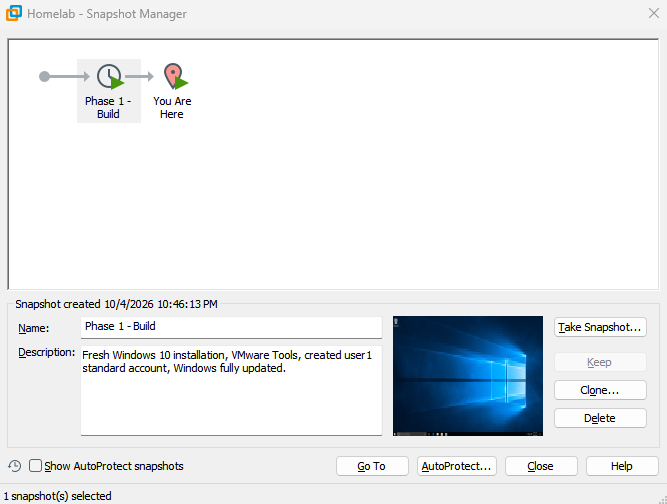

## Static IP Address
 
First I recorded what the VM was using. DHCP Enabled was Yes, so VMware's DHCP server was handing out the address automatically.
 
| Setting | Before (DHCP) | After (static) |
|---|---|---|
| IPv4 address | 192.168.211.139 | 192.168.211.5 |
| Subnet mask | 255.255.255.0 | 255.255.255.0 |
| Default gateway | 192.168.211.2 | 192.168.211.2 |
| DNS server | 192.168.211.2 | 192.168.211.2 |
 
The lease on the DHCP address was only 30 minutes. DHCP addresses are temporary loans, so a machine's address can change. That is why servers, printers, and anything else other devices need to find reliably usually get static addresses.
 
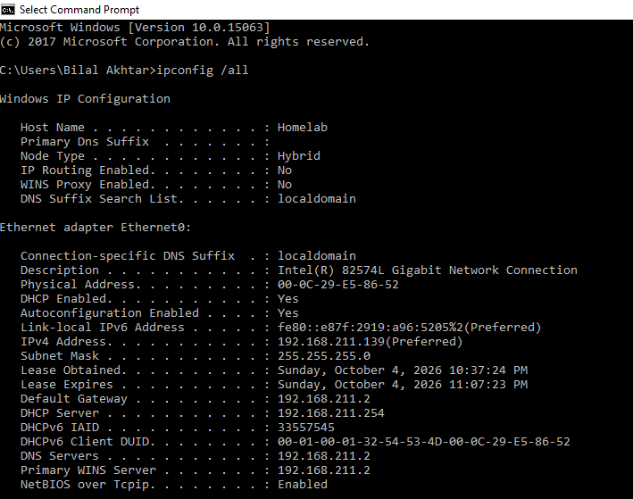
 
I picked 192.168.211.5 for three reasons. It is on the same network as the gateway, it avoids the addresses VMware reserves (.1, .2, and .254), and it sits outside the range DHCP hands out. If a static address sits inside the DHCP range, the DHCP server can give the same address to another device. Two machines then claim it, which is called an IP conflict and causes flaky connections.
 
### A DNS Problem I Diagnosed
 
I left the DNS server blank when I first entered the static settings. I decided to apply it that way and see what broke.
 
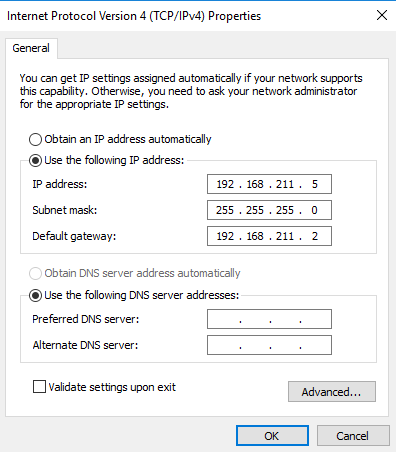
 
Then I ran three pings, in this order:
 
1. `ping 192.168.211.2` (the gateway) got 4 of 4 replies, so the local network and the static IP worked.
2. `ping 8.8.8.8` (a public server, by IP address) got 4 of 4 replies, so the VM could reach the internet.
3. `ping google.com` failed with "could not find host."
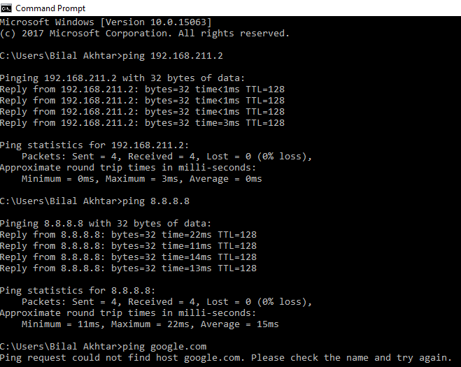
 
Pinging an IP address worked and pinging a name failed. That pattern points to DNS every time, because the network was fine and only the name lookup was broken. It is the same logic as the second step in my [DNS Issue runbook](https://github.com/bilalakhtar-IT/it-troubleshooting-runbook/blob/main/network/dns-issue.md), where I check whether the problem affects everything or only names.
 
The fix was entering 192.168.211.2 as the DNS server.
 
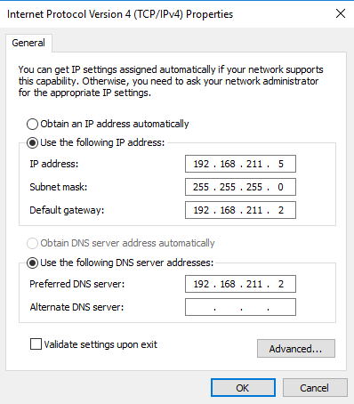
 
After that, `ping www.google.com` worked, and `ipconfig /all` showed DHCP Enabled: No with the address 192.168.211.5.
 
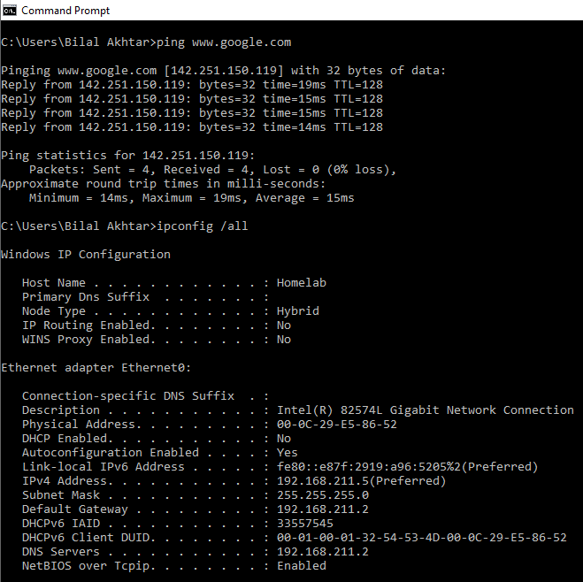
 
## Firewall Rule
 
Windows Firewall blocks inbound ping requests by default. To test that, I pinged the VM from my host computer. All four requests timed out, with 100% loss, even though the VM was running and its network worked.
 
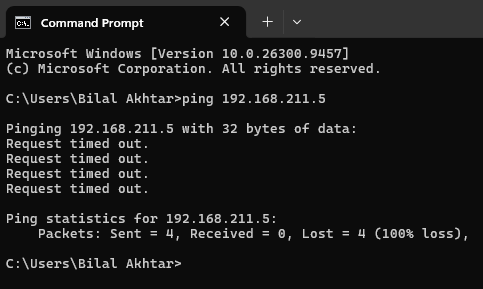
 
An inbound rule controls traffic arriving at a machine and an outbound rule controls traffic leaving it. The host's ping arrives at the VM, so I needed an inbound rule. I created one called Allow ICMPv4 Echo Request, which allows ping requests and nothing else. Opening only what is needed is the principle of least privilege again.
 
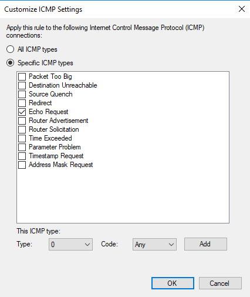
 
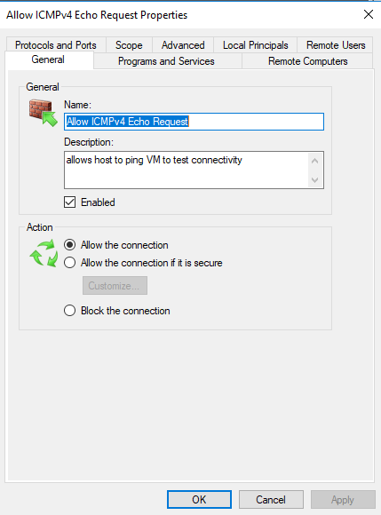
 
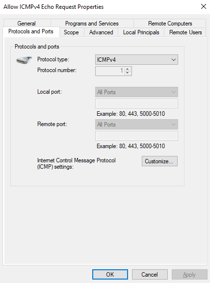
 
After creating the rule, I pinged again from the host and got 4 of 4 replies in under 1 millisecond. The rule was the only thing I changed between the two tests, so it was the fix.
 
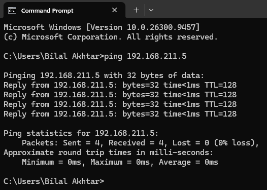
 
## Restore Point
 
System protection was already on for the C: drive, with a maximum of 5% of the disk (2.98 GB). I created a restore point named Phase 2 - After firewall rule.
 
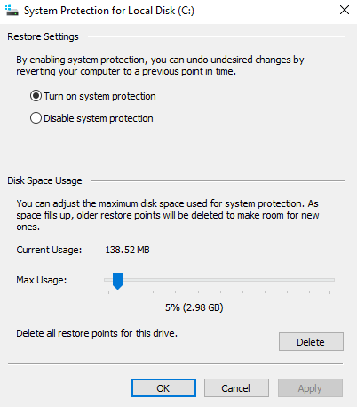
 
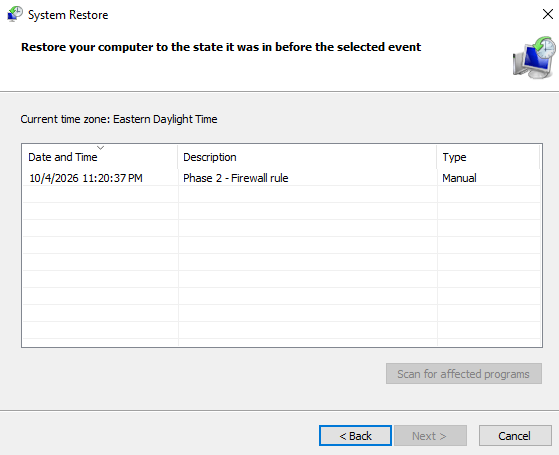
 
A restore point and a VMware snapshot both let you roll back, but they work at different levels.
 
| | VMware snapshot | Windows restore point |
|---|---|---|
| Where it lives | Outside Windows, at the VMware level | Inside Windows |
| What it covers | The whole machine, including disk and memory | System files, drivers, registry, and installed programs |
| Personal files | Rolled back too | Not touched |
| If Windows will not boot | Still works | Only works if recovery options are reachable |
| Where it is available | Virtual machines only | Any Windows PC |
 
## Installing 7-Zip
 
I installed 7-Zip 26.03 (x64), published by Igor Pavlov. After the install it showed up in Apps & features.
 
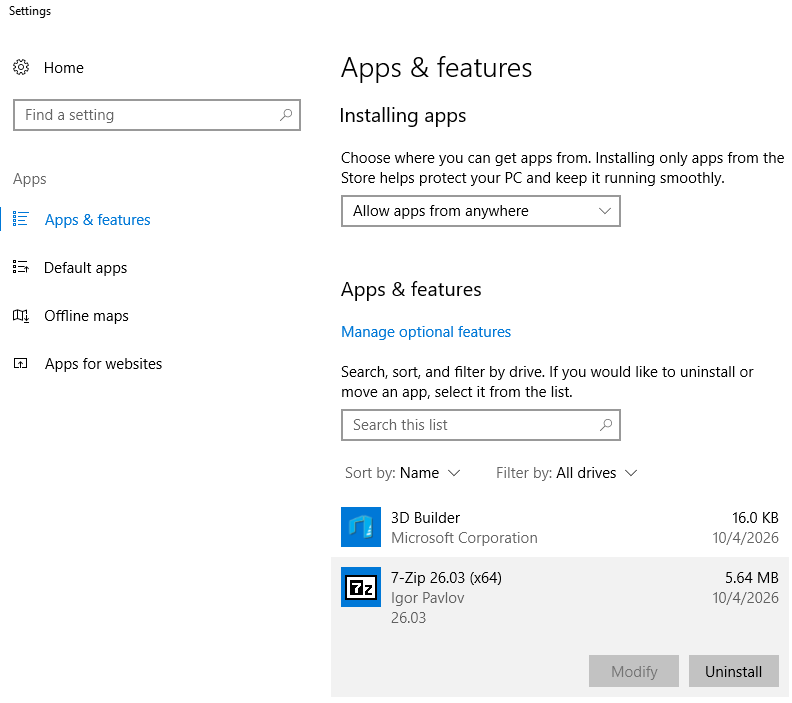
 
The installer had no Digital Signatures tab in its properties, which means it was unsigned. Windows agreed. When a Standard user tried to run the installer, the prompt said Publisher: Unknown. A signature would have shown who published the file and that it had not been changed, but no signature does not mean a file is malicious. Next time I would also record the file's SHA-256 hash and look it up on VirusTotal as an extra check.
 
My first test of 7-Zip was a plain .zip file, but Windows can create and open those without 7-Zip, so it proved nothing. I made a .7z archive instead, a format Windows cannot read on its own, and listed its contents from the command line. The output shows 7-Zip 26.03 reading the archive as type 7z and listing the test file inside. The test file was empty. It only needed to prove that the tool works.
 
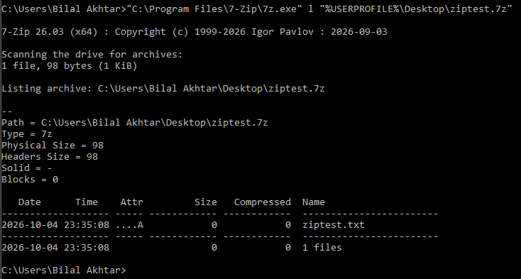
 
When I tried to run the installer from the Standard account, Windows asked for an administrator's name and password before it would continue. This confirms the least-privilege setup from Phase 1 works in practice.
 
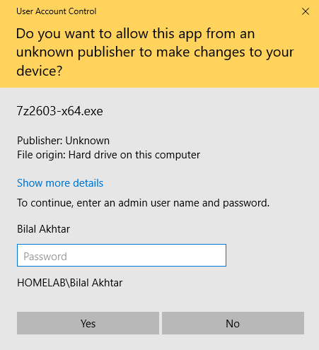
 
## Final Snapshot
 
When the phase was finished, I took a second snapshot so I can return to this exact configured state.
 
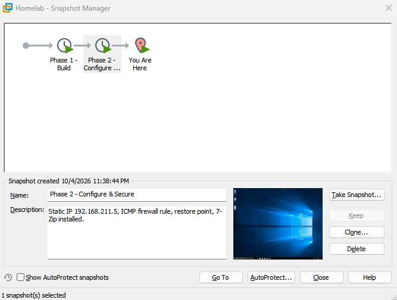
 
## What I Learned
 
- DHCP addresses are temporary and static addresses are reliable, but a static address needs to sit outside the DHCP range
- A ping to an IP that works while a ping to a name fails points to DNS
- Windows Firewall blocks inbound ping by default, and a narrow inbound rule is enough to allow it
- A snapshot and a restore point protect against different things
- A missing signature is not proof of anything, so I need other checks too
